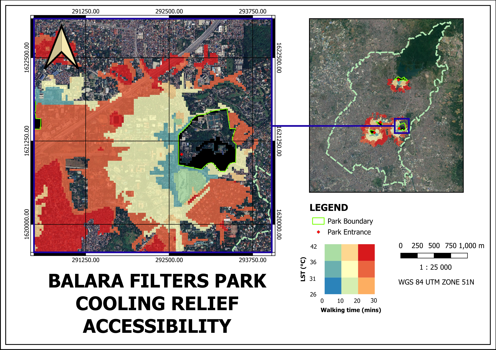
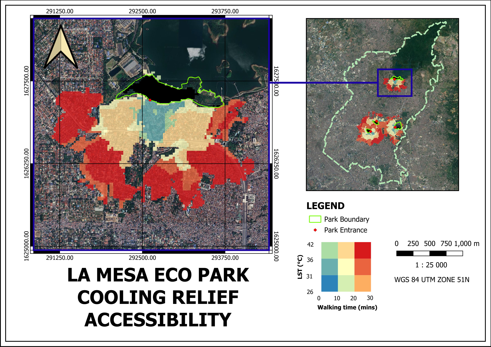
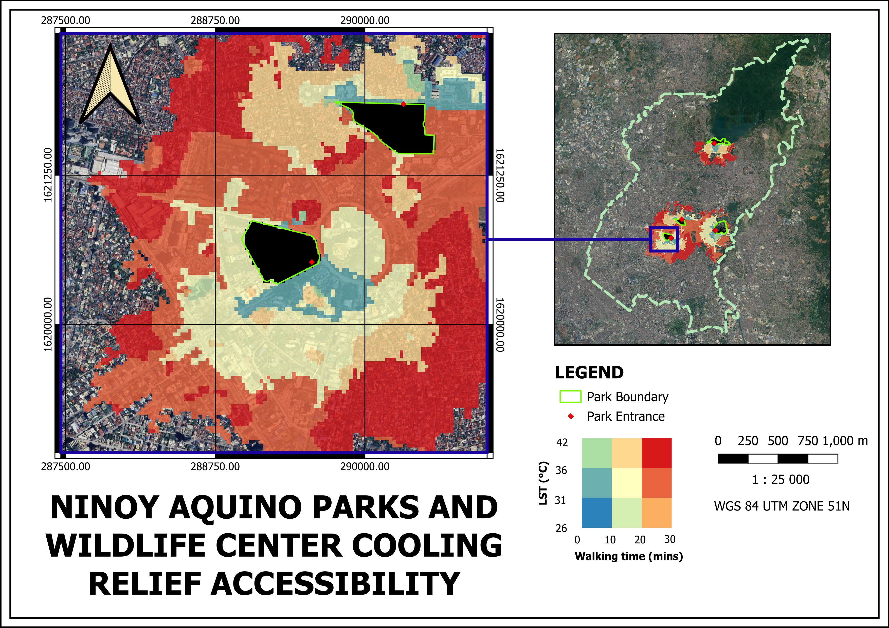
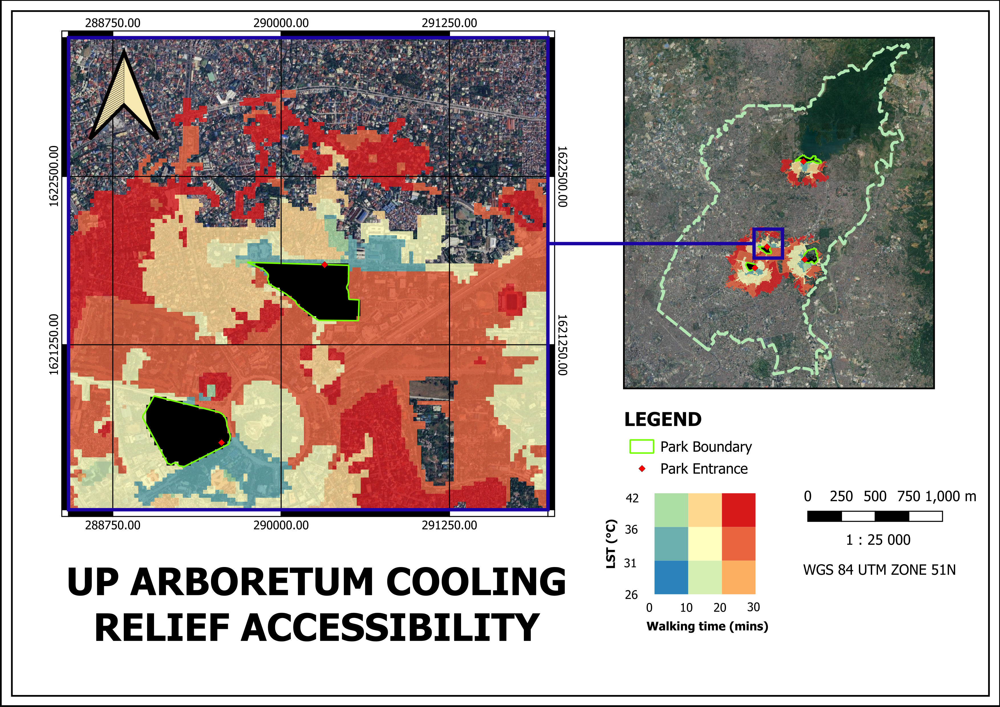

# Spatial Data Science Enthusiast
Welcome to my Spatial Data Science Portfolio! This space highlights my growing journey as a spatial data science enthusiast and showcases the skills demonstrated through my projects.

## 👩‍💻 About Me
Hi! I'm an inquisitive and purpose-driven geodetic engineering student equipped with a solid foundation in both theoretical and technical aspects of surveying, GIS, remote sensing, photogrammetry, and geodesy. In addition to these fields, I'm also trying to explore the growing world of spatial data science, aiming to harness its potential to produce meaningful analyses and insights from spatial data!
---
## 🎓 Education
---
### Bachelor of Science in Geodetic Engineering Undergraduate
University of the Philippines — 4th year standing

---
## 💼 Work Experience

### Geodetic Engineering Intern  
**AB Surveying and Development Intern** — July 2024 to August 2024 

---
## 🔧 Skills
- **Programming Languages:** Python 
- **Tools and Software:** QGIS, ArcGIS, AutoCAD Civil 3D, SketchUp, SNAP, Google Earth Engine, Agisoft Metashape

---

## 🚀 Projects
### 1. **Building Density Exercise**
   - **Description:** Analysis and mapping of building density in Makati City, Philippines using OpenStreetMap data.
   - **Key Activities:**
        -Geocoding Administrative Boundaries
        -Retrieving Building Features
        -Retrieving Road Network
        -Calculating City Building Density
        -Calculating Barangay Building Density

     This exercise aims to analyze and visualize building density in Makati City, Philippines, using data from OpenStreetMap. Its goal is to provide insights            into the distribution of buildings within the city's boundaries. Essentially, the process begins by importing necessary libraries and mounting Google Drive         for importing and exporting files. Building features and their corresponding footprints were retrieved to obtain data for building density calculations. To         provide insights into the degree of urbanization, the total building area was calculated and the building density was determined as the ratio of the total          building area with the total area of the city. It further analyzes building density within the barangays of Makati City by computing the density for each.          Finally, the code generates a visual map displaying building density across barangays, with labels for easy identification. 

   - [View the Code Here!](https://drive.google.com/file/d/1BSuEyA8OBftwujxce9dmZ7pclmz6AOb0/view?usp=sharing)

### 2. **Analyzing Rental Places Data in Metro Manila**
   - **Description:** Comprehensive analysis of rental places in Metro Manila, specifically examining variables that influence rental prices using proximity    analysis, statistical analyses (correlation matrix and Moran's I), and spatial regression models.
   - **Key Activities:**
        -Data Manipulation
        -Proximity Analysis
        -Statistical Analysis
        -Regression Modelling

     

     Using rental property data from TripAdvisor, the spatial context of the properties was assessed by identifying nearby restaurants and drivable roads. The           distances from the rental properties to the nearest restaurants and roads were calculated and stored in a new column for analysis. Additionally, the base           daily rates of the properties were mapped to visualize their distribution. To prepare for spatial regression and spatial autocorrelation analyses, a                correlation matrix was created to assess multicollinearity among the variables. The Moran’s I statistic was also calculated to determine the clustering or          dispersion of the properties based on rental prices. Finally, regression models were generated to evaluate the influence of the identified factors on the           rental prices of properties in Metro Manila from a spatial perspective. The results indicated that the number of bathrooms has the most significant influence       on rental prices.

     
     
   - [View the Code Here!](https://drive.google.com/file/d/1_lL7jQSbrut_Io7OxJWJyDGubs7zaNJD/view?usp=sharing)

### 3. **Mapping Urban Cooling Relief Accessibility of Selected Parks in Quezon City**
   - **Description:** Designed an efficient stormwater drainage system for flat terrain agricultural land.
   - **Key Activities:**
        -Land Surface Temperature (LST) mapping
        -Walking isochrones mapping
        -Bivariate mapping

     Our capstone project, “Mapping Urban Cooling Relief Accessibility of Selected Parks in Quezon City,” aims to identify and map:

        1. Green Spaces: Public parks that can serve as urban cooling zones.
        2. Heat Zones: Areas with high land surface temperatures (LST).
        3. Accessibility Analysis: The proximity of residents to green spaces within a 10, 20, and 30-minute walking range.
      
     Through spatial analysis, our project revealed which areas in Quezon City lack adequate access to cooling green spaces, offering valuable insights to urban         planners for targeted urban greening initiatives. The bivariate map captures the spatial distribution of LST in relation to walking accessibility to urban          parks, effectively highlighting thermal inequities and park cooling influence.

   - [View the Code Here!](https://drive.google.com/file/d/1Qbb30tNsHBCD_5Ubzah1aq5KfR_AF6D_/view?usp=sharing)

     *Note: The code only includes LST retrieval and isochrones. If you want to download the QGIS file for the bivariate map you can access it through this [link](https://drive.google.com/drive/folders/1gp95bhiu_aGbU-zLPJfUqC9a72S20veE?usp=sharing)

     Alternatively, you can just view the maps below :)
     
   - **Map Outputs**
     -
     -
     -
     -
     
     

---
## 📬 Contact
- **Email:** jcguadalupe@up.edu.ph
- **LinkedIn:** [Check me out on LinkedIn!](https://www.linkedin.com/in/joem-guadalupe-4b4a662b9/)

Feel free to explore my projects and reach out if you have inquiries!

